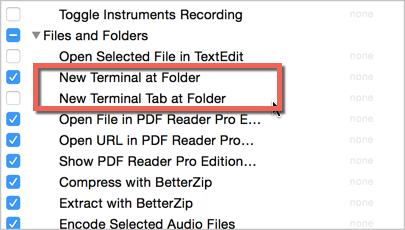

# 知识体系

- 文件、目录与权限
    - 系统自带的特殊目录及其作用
        - [苹果新手Mac OS X 使用笔记－－系统目录结构](http://blog.csdn.net/smstong/article/details/15499661)

# Mac软件清单

* 360云盘.app
* AirServer.app
* Alfred 2.app
* AliWangwang.app
* Android File Transfer.app
* App Store.app
* AppCleaner.app
* Atom.app
* Automator.app
* Axure RP Pro 7.0.app
* Balsamiq Mockups 3.app
* BetterZip.app
* Beyond Compare.app
* BookReaderLite.app
* CHM Reader.app
* Calculator.app
* Calendar.app
* Chess.app
* Coda 2.app
* Contacts.app
* DVD Player.app
* Dash.app
* Dashboard.app
* Dictionary.app
* Elmedia Player.app
* Evernote.app
* FaceTime.app
* Firefox.app
* Folx.app
* Font Book.app
* GIMP.app
* Game Center.app
* GarageBand.app
* Google Chrome.app
* Hype2.app
* IPMessenger.app
* Image Capture.app
* Infographics.app
* Inkscape.app
* IntelliJ IDEA 14.app
* Jump Desktop.app
* Keynote.app
* Launchpad.app
* MATLAB_R2014b.app
* MacDown.app
* Mail.app
* Maps.app
* Mathematica.app
* Messages.app
* Microsoft Excel.app
* Microsoft OneNote.app
* Microsoft Outlook.app
* Microsoft PowerPoint.app
* Microsoft Word.app
* Mindjet MindManager.app
* Mission Control.app
* Notes.app
* Numbers.app
* OmniGraffle.app
* OneDrive.app
* Pages.app
* Photo Booth.app
* Photos.app
* Pocket.app
* Pomodoro Time.app
* Preview.app
* PyCharm.app
* QQ.app
* QQMusic.app
* QuickTime Player.app
* Reeder.app
* Reminders.app
* Safari.app
* Set for iWork.app
* Sketch.app
* Skype.app
* Snagit.app
* SourceTree.app
* Stickies.app
* Sublime Text.app
* System Preferences.app
* TeamViewer.app
* TextEdit.app
* Thunder.app
* Time Machine.app
* Ulysses.app
* Utilities
* VLC.app
* VMware Fusion.app
* Visual Studio Code.app
* WeChat.app
* WebStorm.app
* Wireshark.app
* Xcode.app
* iBooks Author.app
* iBooks.app
* iMovie.app
* iTunes.app
* 百度云同步盘.app

# Futhur Reading

- [好文推荐，《Mac OS X 背后的故事》](https://www.v2ex.com/t/154959)

# FAQ

## Windows和Mac OS X的一些区别？

- [Mac的基础知识](http://www.apple.com/cn/support/macbasics/)
- [切换 101：在 Windows 上，我常常……](https://support.apple.com/zh-cn/HT2514)
- [Windows系统与Mac系统的简单区别](http://wiki.blueidea.com/index.php?title=Windows系统与Mac系统的简单区别)

## Macbook OS X Yosemite快捷键？

- [OS X键盘快捷键](https://support.apple.com/zh-cn/HT201236)
- 打开System Preferences ->  Keyboard -> Shortcuts查看

## MacOS有哪些好用的SSH客户端？

参考：[Mac OS X 平台有哪些好用的 SSH 客户端？](http://www.zhihu.com/question/20541129), 最好掌握[iTerm2](https://www.iterm2.com/index.html)和[tmux](http://tmux.sourceforge.net/)。

## MacOS建议使用什么包管理工具？

[Homebrew](http://brew.sh/)

## 如何配置Mac开发环境？

参考：[Mac开发配置手册](https://www.gitbook.com/book/aaaaaashu/mac-dev-setup/details)

## Macbook Terminal中有哪些快捷键？

* 清屏：Command + K 或者 Control + L
* 新建标签： Command + T
* 关闭当前标签页： Command +W
* 保存终端输出：Command + S
* 水平分隔当前标签页： Command + D (注意iTerm2中，Command+D是纵向分割)
* 取消水平分隔： Command + Shift + D （注意iTerm2中，Command+D是水平分割）
* 向左/向右切换标签： Command + shift + { 或 }
* control + a / e    回到命令行头/尾
* option + b / f     向前/后跳一个单词
* control +u /k    删除光标前/后 所有单词
* control + y       撤销上个操作

## 如何在Finder右键菜单中直接打开Shell？

- 通过Automator创建一个Service，参考[open-shell-at-selected-folder-via-automater-service](http://blog.xcodev.com/archives/open-shell-at-selected-folder-via-automater-service/)
- 通过菜单Finder -> Services->Services Preferences，找到"Files and Folders"下的"New Terminal xxx"并勾选上  

## Mac OS X如何使用系统自带功能截屏？

参考：[How To Capture a Screen Shot with Mac OS X](http://graphicssoft.about.com/od/screencapturemac/ht/macscreenshot.htm)

* To capture the entire desktop, press `Command-Shift-3`.
* To copy the entire desktop to clipboard, press `Command-Control-Shift-3`.
* To capture a portion of the desktop, press `Command-Shift-4`.
* To capture a specific application window, press `Command-Shift-4`, then press the Spacebar. The screen shot will be saved as a PNG file on your desktop. (The file is saved as PDF in Mac OS 10.3 and earlier.)
* Add `Control` to the two shortcuts above to place the screen shot on the clipboard instead of saving it to the desktop.
* Another method for capturing screen shots in Mac OS X is by using the bundled Apple utility, **Grab**, located in the *Applications > Utilities* folder. Grab is useful if you need to include a cursor or a menu in your screen shot, or if you want to save your screen shot to TIFF format.

## 如何通过Boot Camp Assistance在MacBook Pro上安装Windows？

参考：[Apple Help - Bootcamp](http://www.apple.com/support/bootcamp/)

注意下面几点：

* Windows分区一旦创建并且安装了Windows，以后再次调整Windows分区大小，需要重新安装Windows。所以安装windows前事先做好容量规划。
* 安装好Windows分区后，需要安装bootcamp drivers，位置在制作好的usb启动盘的bootcamp目录下
* 安装了bootcamp windows以后，macbook启动时按住option键，可以选择进入mac os还是windows
* 安装了bootcamp windows以后，mac os x的桌面会多出一个bootcamp磁盘，打开可以访问（读写）windows分区的文件

## Bootcamp Windows中如何访问Mac OS X的分区？

参考：

* [Why I can not see mac partition under windows installed with bootcamp?](http://apple.stackexchange.com/questions/167874/why-i-can-not-see-mac-partition-under-windows-installed-with-bootcamp)
* [How to access your OS X partition from Windows in Boot Camp](http://www.simplehelp.net/2008/07/21/how-to-access-your-os-x-partition-from-windows-in-boot-camp/)

Mac OS X Yosemite的Bootcamp driver中是支持Windows访问Mac OS X分区的，但是如果在Mac OS X打开了FileVault，由于FileVault会对SSD上的所有文件进行加密，这样Windows就无法访问Mac OS X分区上的文件。只要把FileVault关掉，再进入bootcamp Windows，就可以看到Mac OS X分区，但是只能读，不能写。

## 如何让Bootcamp Windows上的触摸板操作体验和Mac OS X一样？

参考：

* [3 Tools to Make Your Mac’s Hardware Work Better in Windows with Boot Camp](http://www.howtogeek.com/197485/3-tools-to-make-your-macs-hardware-work-better-in-windows-with-boot-camp/)

我的Bootcamp Windows目前使用的是Trackpad++，注意Trackpad++依赖Power Plan Assistant，安装Trackpad++前必须安装Power Plan Assistant。

